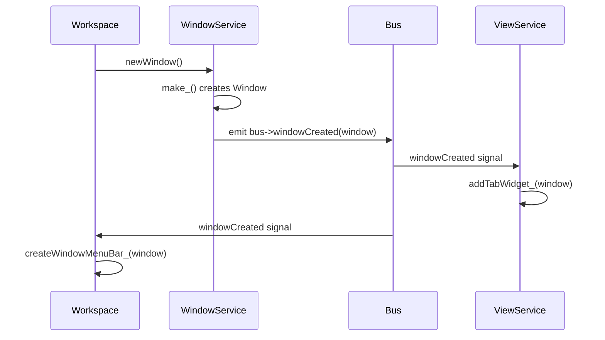
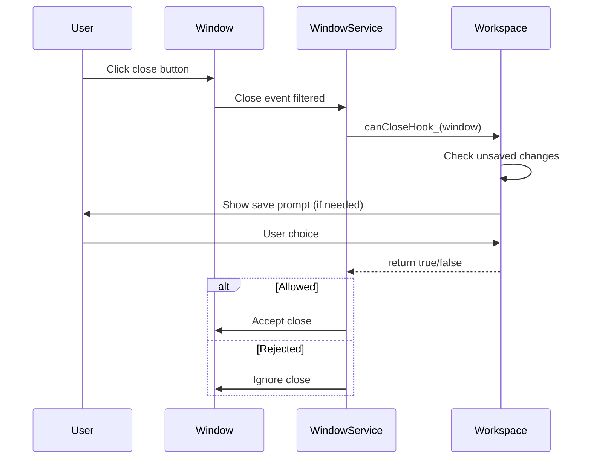
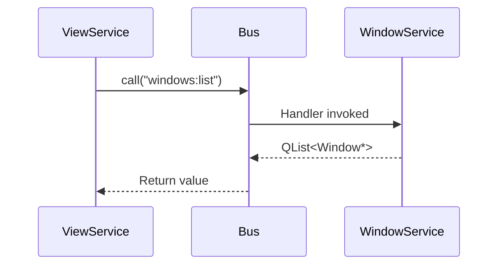

# Architecture

Fernanda uses an event-driven architecture with clear separation between mechanics and policy. This document explains the structural patterns and their rationale.

See: [`Application.h`](../src/Application.h), [`Bus.h`](../src/Bus.h), [`Commander.h`](../src/Commander.h), [`AbstractService.h`](../src/AbstractService.h), [`Workspace.h`](../src/Workspace.h), [`WindowService.h`](../src/WindowService.h), and [`ViewService.h`](../src/ViewService.h)

## Overview

```
Application
+-- Workspace (1 or more)
    |-- Bus (commands + events)
    |-- Services (mechanics)
    +-- Modules (optional features)
```

The architecture draws inspiration from editors like VSCode and Sublime Text:
- **Loose coupling** via message passing (commands and events)
- **Services** handle *how* things work
- **Workspaces** decide *what* should happen
- **Hooks** let Workspaces inject policy into Service operations

## Core Concepts

### Application

`Application` is the top-level coordinator. It:
- Creates and manages Workspace lifetimes
- Routes file arguments to appropriate Workspaces
- Handles application-wide lifecycle (quit, session management)
- Does *not* participate in the command/event system

### Workspace

A Workspace is a logical grouping of windows, their contents, and the filesystem they operate on. Each Workspace owns:
- A `Bus` it owns and gives to each Service to allow lateral communication between them
- A set of `Services` for core mechanics
- Optional `Modules` for additional features

```cpp
class Workspace : public QObject {
protected:
    Bus* bus;
    WindowService* windows;
    ViewService* views;
    FileService* files;
    TreeViewService* treeViews;
    SettingsService* settings;
    ColorBarModule* colorBars;
    // ...
};
```

Workspaces define policy by:
1. **Implementing hooks** that Services call at decision points
2. **Connecting to Bus events** to react to state changes
3. **Registering command handlers** for Workspace-specific behavior

### Bus

The Bus enables lateral communication between Services without direct coupling. It combines two patterns:

**Commands**: Request-response operations
- Dynamically registered handlers
- Can return values
- One handler per command ID

**Events**: Broadcast notifications
- Statically defined Qt signals
- Multiple listeners
- No return values

```cpp
class Bus : public Commander {
    Q_OBJECT
    
    // Command IDs
    constexpr static auto WINDOWS_SET = "windows:set";
    constexpr static auto GET_SETTING = "settings:get";
    // ...

signals:
    // Events
    void windowCreated(Window* context);
    void windowDestroyed(Window* context);
    void fileModelReadied(Window* context, AbstractFileModel* fileModel);
    void fileModelModificationChanged(AbstractFileModel* fileModel, bool modified);
    void settingChanged(const QString& key, const QVariant& value);
};
```

#### Commander vs. Bus

`Commander` is a reusable, generic command registration/dispatch system, it could be extracted to another project (or moved to Coco as a general-purpose utility). `Bus` is the Fernanda-specific subclass that:

1. Inherits `Commander` to *be* a commander
2. Adds the application-specific Qt signals (events)
3. Defines the application-specific command ID constants

The split is essentially: **generic machinery** (Commander) vs. **domain vocabulary** (Bus).

The Bus addresses **cross-Service (lateral) concerns**. When ServiceA needs something from ServiceB, it goes through the Bus rather than holding a direct reference.

### Services

Services are the mechanical layer, they know *how* to do things but not *when* or *why*. Each Service:
- Inherits from `AbstractService`
- Receives a `Bus*` at construction
- Implements `registerBusCommands()` and `connectBusEvents()`
- Exposes hooks for policy injection

```cpp
class AbstractService : public QObject {
public:
    AbstractService(Bus* bus, QObject* parent = nullptr);
    
    void initialize() {
        if (initialized_) return;
        registerBusCommands();
        connectBusEvents();
        initialized_ = true;
    }

protected:
    Bus* bus;
    virtual void registerBusCommands() = 0;
    virtual void connectBusEvents() = 0;
};
```

Services are initialized explicitly after construction. This two-phase initialization ensures all Services exist before any try to communicate via the Bus.

### Modules

Modules are optional Services, they follow the same pattern but provide features that could be disabled or swapped. The distinction is conceptual rather than technical.

| Type | Purpose | Examples |
|------|---------|----------|
| Service | Core mechanics, always needed | WindowService, ViewService, FileService |
| Module | Optional features | ColorBarModule, WordCounterModule |

## Communication Patterns

### Commands

Commands use a `scope:action` naming convention:

```cpp
// Registration (in Service::registerBusCommands)
bus->addCommandHandler("windows:list", [&] { 
    return windows(); 
});

// Execution (from anywhere with Bus access)
auto windowList = bus->call<QList<Window*>>("windows:list");
```

Command handlers can accept a `Command` struct containing parameters and a window context:

```cpp
bus->addCommandHandler("settings:get", [&](const Command& cmd) {
    auto key = cmd.param<QString>("key");
    auto defaultValue = cmd.param("defaultValue");
    return settings_.value(key, defaultValue);
});

// Called as:
auto font = bus->call<QFont>("settings:get", {
    { "key", "editor/font" },
    { "defaultValue", QVariant::fromValue(defaultFont) }
});
```

### Events

Events are standard Qt signals. Services emit them; anyone can connect:

```cpp
// In WindowService, after creating a window:
emit bus->windowCreated(window);

// In Workspace setup:
connect(bus, &Bus::windowCreated, this, [&](Window* window) {
    // React to new window
});
```

### When to Use Which

| Use Commands When... | Use Events When... |
|----------------------|---------------------|
| You need a return value | Broadcasting state changes |
| Requesting an action | Notifying about something that happened |
| One handler should respond | Multiple listeners may care |
| The caller needs confirmation | Fire-and-forget notification |

Commands are vocabulary ("do this thing"). Events are grammar ("this thing happened").

## Hooks

Hooks let Workspaces inject policy into Service operations. A Service defines the hook type and provides a setter; the Workspace implements the logic.

```cpp
// In WindowService:
using CanCloseHook = std::function<bool(Window*)>;

DECLARE_HOOK_ACCESSORS(
    CanCloseHook,
    canCloseHook,
    setCanCloseHook,
    canCloseHook_);

// Usage in WindowService:
if (canCloseHook_ && !canCloseHook_(window)) 
    return;  // Workspace rejected the close
```

```cpp
// In Workspace subclass:
windows->setCanCloseHook(this, &MyWorkspace::canCloseWindow);

bool MyWorkspace::canCloseWindow(Window* window) {
    // Check for unsaved changes, prompt user, etc.
    return true;  // or false to prevent close
}
```

The `DECLARE_HOOK_ACCESSORS` macro generates:
- A getter returning the current hook
- A setter accepting a `std::function`
- A setter accepting a member function pointer (for cleaner syntax)

### Hook Design Philosophy

Services define *what* can be hooked (close operations, model creation, etc.). Workspaces define *how* to handle those situations.

This separation means:
- Services remain reusable across Workspace types
- Policy lives in one place (the Workspace)
- Services don't need to know about save prompts, archive formats, etc.

## Architectural Diagram

```mermaid
flowchart TD
    App[Application]
    App -->|owns| Notepad[Notepad<br/>Single Instance]
    App -->|owns| Notebooks[Notebook<br/>0..N Instances]

    Notepad -.->|is| Workspace[Workspace]
    Notebooks -.->|is| Workspace

    Workspace -->|owns| Bus[Bus]
    Workspace -->|owns| Services[Services/Modules]

    Workspace <-.->|hooks| Services
    Services <-.->|commands<br/>& events| Bus

    Services -.-> WindowService[WindowService]
    Services -.-> ViewService[ViewService]
    Services -.-> FileService[FileService]
    Services -.-> MiscServices[... Other Services/Modules]

    WindowService -->|creates & tracks| Windows[Window 0..N]
    ViewService -.->|creates| TabWidget[TabWidget]
    Windows -->|takes| TabWidget

    ViewService -.->|creates| AbstractFileViews[AbstractFileView 0..N]
    TabWidget -->|takes| AbstractFileViews

    FileService -->|creates & owns| AbstractFileModels[AbstractFileModel 0..N]

    AbstractFileViews -->|shows| AbstractFileModels

    style Bus fill:#335c67
    style Services fill:#335c67
    style Notepad fill:#9e2a2b
    style Notebooks fill:#1d3557
```



## Data Flow Examples

### Creating a Window

// TODO: Check that this format is ideal? Little confusing but factually correct.



### Closing a Window

// TODO: Check that this format is ideal? Little confusing but factually correct.



### Cross-Service Query



## Design Rationale

### Why Commands + Events?

Pure event-driven architectures struggle with request-response patterns. Pure command patterns don't handle broadcast notifications well. Combining them gives us:

- **Commands** for queries and actions that need confirmation
- **Events** for state change notifications

### Why Hooks Instead of Virtual Methods?

Hooks via `std::function` offer advantages over pure virtual methods:

1. **Selective override**: Only hook what you need
2. **Composition**: Hooks can be lambdas capturing local context
3. **Runtime flexibility**: Hooks can be changed or cleared
4. **Cleaner Services**: No need for abstract Service base classes

### Why Separate Bus Per Workspace?

Each Workspace has its own Bus, meaning Services in one Workspace can't accidentally communicate with Services in another. This isolation:

- Prevents cross-contamination of state
- Simplifies reasoning about message flow
- Matches the conceptual model (Workspaces are independent)

### Why Two-Phase Initialization?

Services are constructed, *then* initialized:

```cpp
WindowService* windows = new WindowService(bus, this);
ViewService* views = new ViewService(bus, this);
// ... all Services created ...

windows->initialize();
views->initialize();
// ... all Services initialized ...
```

This ensures every Service exists before any registers commands or connects to events. Without this, initialization order bugs would be common.

## Guidelines

### For Services

1. **Register commands** for operations other Services might need
2. **Emit events** when state changes that others might care about
3. **Define hooks** for decision points where policy matters
4. **Never** hold direct references to other Services
5. **Never** make policy decisions (that's the Workspace's job)

### For Workspaces

1. **Implement hooks** to inject your policy
2. **Connect to events** to react to state changes
3. **Register command handlers** for Workspace-specific operations
4. **Coordinate** between Services when complex operations span multiple concerns

### For Modules

1. Follow the same patterns as Services
2. Be **optional**, the system should work without you
3. Keep scope narrow, one feature per Module

## Future Considerations

- **Plugin system**: Modules could become loadable plugins
- **Cross-Workspace commands**: For operations that span Workspaces
- **Command middleware**: For logging, undo/redo, etc.
- **Async commands**: For long-running operations
