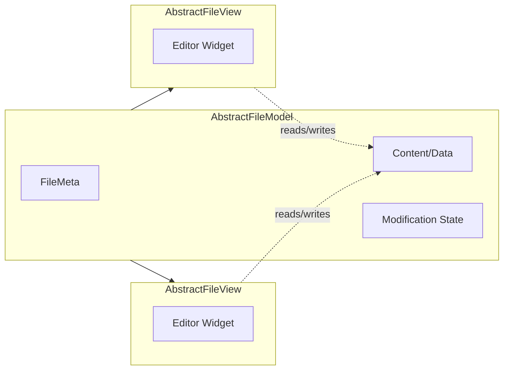

# File Models and Views

Fernanda separates file content management from its visual representation using paired abstract classes: `AbstractFileModel` (content and state) and `AbstractFileView` (display and interaction).

See: [`AbstractFileModel.h`](../src/AbstractFileModel.h), [`AbstractFileView.h`](../src/AbstractFileView.h), [`FileMeta.h`](../src/FileMeta.h), [`TextFileModel.h`](../src/TextFileModel.h), [`TextFileView.h`](../src/TextFileView.h), [`NoOpFileModel.h`](../src/NoOpFileModel.h), and [`NoOpFileView.h`](../src/NoOpFileView.h)

## Overview

```
AbstractFileModel          AbstractFileView
|-- FileMeta (metadata)    |-- References model
|-- Content (data)         |-- Widget setup
|-- Modification state     +-- Editing operations
+-- Undo/redo
```

This separation allows:
- **Multiple views** on a single model (same file in different windows)
- **Different view types** for the same model (future: preview vs. edit modes)
- **Model persistence** independent of view lifecycle
- **Extensibility**: New file types (images, PDFs) or alternative views (Markdown preview) without changing existing code

## AbstractFileModel

The model holds file content and tracks its state. It does *not* perform I/O, that's FileService's job.

```cpp
class AbstractFileModel : public QObject {
public:
    FileMeta* meta() const;              // Path, title, tooltip
    virtual QString preferredExtension() const;
    
    virtual QByteArray data() const = 0; // Content for saving
    virtual bool supportsModification() const = 0;
    
    virtual void setData(const QByteArray& data);
    virtual bool isModified() const;
    virtual void setModified(bool modified);
    virtual bool hasUndo() const;
    virtual bool hasRedo() const;
    virtual void undo();
    virtual void redo();

signals:
    void modificationChanged(bool modified);
    void undoAvailable(bool available);
    void redoAvailable(bool available);
};
```

### FileMeta

Each model owns a `FileMeta` that manages path and display information:

| Property | Description |
|----------|-------------|
| `path()` | File path (empty if not on disk) |
| `isOnDisk()` | Whether the file has been saved |
| `title()` | Display name for tabs |
| `toolTip()` | Full path or status hint |

Title priority: custom override -> path stem -> "Untitled"

### Concrete Implementations

**TextFileModel**: Wraps `QTextDocument` for plain text editing with full undo/redo support. Automatically generates titles from content for unsaved files.

**NoOpFileModel**: Minimal implementation for non-editable content. Returns empty data and doesn't support modification.

## AbstractFileView

The view displays model content and handles user interaction. Each view references exactly one model, but a model may have multiple views.

```cpp
class AbstractFileView : public QWidget {
public:
    void initialize();  // Must be called after construction
    AbstractFileModel* model() const;
    
    virtual bool supportsEditing() const = 0;
    
    virtual bool hasPaste() const;
    virtual bool hasSelection() const;
    virtual void cut();
    virtual void copy();
    virtual void paste();
    virtual void deleteSelection();
    virtual void selectAll();

signals:
    void selectionChanged();
    void clipboardDataChanged();

protected:
    virtual QWidget* setupWidget() = 0;  // Subclasses create their widget here
};
```

### Two-Phase Initialization

Views require explicit initialization after construction:

```cpp
auto view = new TextFileView(model, parent);
view->initialize();  // Calls setupWidget(), sets up layout
```

This pattern ensures the view is fully constructed before its widget is created, avoiding issues with virtual method calls during construction.

### Concrete Implementations

**TextFileView**: Wraps `PlainTextEdit` for text editing. Exposes editor settings (font, word wrap, tab stops) and implements all editing operations.

**NoOpFileView**: Placeholder view for non-editable models.

## Relationship Diagram



## Lifecycle

### Model Lifecycle

1. **Creation**: FileService creates model, optionally loads data from disk
2. **Readying**: FileService emits `fileModelReadied`, ViewService creates a view
3. **Usage**: Model tracks modifications, views display and edit
4. **Saving**: FileService calls `model->data()` and writes to disk
5. **Destruction**: When last view closes (Notepad) or Workspace closes (Notebook)

### View Lifecycle

1. **Creation**: ViewService creates view with model reference
2. **Initialization**: `initialize()` sets up the internal widget
3. **Display**: View added to TabWidget, receives focus
4. **Destruction**: Tab closed, view deleted (model may persist)

## Design Notes

### Why Separate Model and View?

- **Notepad**: Closing the last view on a model closes the model (file is "closed")
- **Notebook**: Models persist even when all views close (file remains in archive)

This different policy is handled at the Workspace level, not baked into the classes.

### Why `data()` Returns QByteArray?

Content is returned as raw bytes for FileService to write. This keeps encoding decisions in one place and supports future binary file types.

### Why Virtual Methods with Default No-Ops?

Not all models support modification (e.g., read-only files, binary previews). Default implementations return safe values (`false`, empty), letting subclasses opt into capabilities rather than requiring stubs.
