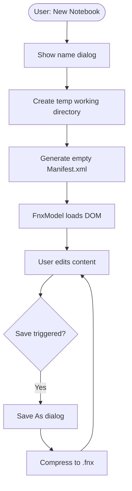
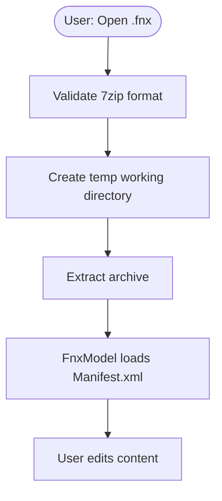
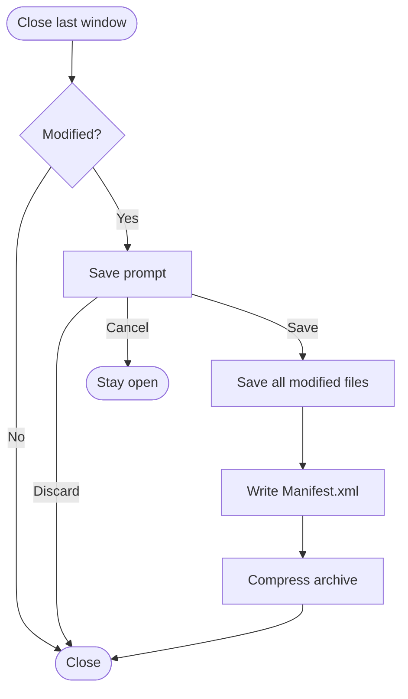

# Notebooks

Notebooks are archive-based Workspaces for organizing writing projects. Unlike Notepad (which works directly on the OS filesystem), Notebooks store all content inside a single `.fnx` archive file, a standard 7zip archive containing text files and an XML manifest describing the virtual directory structure.

See: [`Notebook.h`](../src/Notebook.h), [`Fnx.h`](../src/Fnx.h), [`FnxModel.h`](../src/FnxModel.h), [`FnxModelCache.h`](../src/FnxModelCache.h), [`Workspace.h`](../src/Workspace.h), and [`TempDir.h`](../src/TempDir.h)

## Overview

A Notebook provides:
- **Virtual organization**: Files and folders arranged independently of their physical storage
- **Self-contained projects**: Everything lives in one portable `.fnx` file
- **Recoverability**: Standard 7zip format means content remains accessible outside ../Fernanda
- **Multiple instances**: Unlike Notepad (singleton), any number of Notebooks can be open simultaneously

## Architecture

```
Notebook Workspace
|-- fnxPath_        -> Path to .fnx archive (may not exist yet for new Notebooks)
|-- workingDir_     -> Temporary directory for extracted content
|-- fnxModel_       -> Qt model adapter for DOM + TreeView
+-- Services        -> (inherited from Workspace)
    |-- WindowService
    |-- ViewService
    |-- FileService
    |-- TreeViewService
    +-- SettingsService
```

### Class Responsibilities

| Class/Namespace | Responsibility |
|-----------------|----------------|
| `Notebook` | Policy, working directory lifecycle, wires components together |
| `FnxModel` | Qt model/view adapter, DOM ownership, tree operations |
| `FnxModelCache` | Stable ID tracking for DOM elements (prevents QPersistentModelIndex crashes) |
| `Fnx::Io` | Archive extraction/compression, working directory setup |
| `Fnx::Xml` | DOM element factories and queries (stateless helpers) |

## The FNX File Format

An `.fnx` file is a 7zip archive with a rigid internal structure:

```
MyNovel.fnx (7zip archive)
|-- Manifest.xml        # Virtual directory structure
|-- Settings.ini        # Notebook-specific settings (optional)
+-- content/            # Physical file storage
    |-- a1b2c3d4-e5f6-7890-abcd-ef1234567890.txt
    |-- b2c3d4e5-f6a7-8901-bcde-f12345678901.txt
    +-- ...
```

### Content Directory

Files in `content/` are named by UUID with normalized extensions:
- File names: `{uuid}.txt`
- The UUID ensures uniqueness and enables stable references
- Display names are stored in `Manifest.xml`, not the filesystem

### Manifest.xml Schema

```xml
<?xml version="1.0"?>
<fnx version="1.0">
  <notebook>
    <vfolder name="Chapter 1" uuid="xxx1">
      <file name="Scene 1" uuid="xxx2" extension=".txt"/>
      <file name="Scene 2" uuid="xxx3" extension=".txt"/>
    </vfolder>
    <file name="Notes" uuid="xxx4" extension=".txt">
      <file name="Research" uuid="xxx5" extension=".txt"/>
    </file>
  </notebook>
  <trash>
    <!-- Deleted items live here until emptied -->
  </trash>
</fnx>
```

#### Element Tags

| Tag | Description |
|-----|-------------|
| `fnx` | Document root (contains `notebook` and `trash`) |
| `notebook` | User-visible root for active content |
| `trash` | Container for soft-deleted items |
| `vfolder` | Virtual folder (organizational only, no physical file) |
| `file` | Reference to a content file |

Both `vfolder` and `file` elements may contain nested children. Files can have children for outlining/hierarchy purposes.

#### Attributes

**Common (both `vfolder` and `file`):**

| Attribute | Required | Description |
|-----------|----------|-------------|
| `name` | Yes | Display name shown in TreeView |
| `uuid` | Yes | Unique identifier (also the filename in `content/`) |

**File-specific:**

| Attribute | Required | Description |
|-----------|----------|-------------|
| `extension` | Yes | File extension (e.g., `.txt`) |
| `edited` | No | Presence indicates unsaved changes (runtime-only) |
| `parent_on_restore_uuid` | No | Original parent UUID for trash restoration |

> **Important**: The `edited` attribute is runtime-only and must be stripped before archive compression.

#### Default Values

| Context | Attribute | Default |
|---------|-----------|---------|
| New file | `name` | `Untitled` |
| New virtual folder | `name` | `New folder` |

## Working Directory

When a Notebook is opened or created, ../Fernanda extracts (or creates) a temporary working directory:

```
{temp}/MyNovel.fnx~XXXXXX/
|-- Manifest.xml
|-- Settings.ini
+-- content/
    +-- {uuid}.txt files
```

### Key Behaviors

- **Naming**: Working directory name is based on the original `.fnx` filename with a random suffix
- **Persistence**: The working directory name remains unchanged for the Notebook's lifetime, even after "Save As" to a different filename
- **Cleanup**: Working directory is automatically deleted when the Notebook closes (via `QTemporaryDir`)

### Why Working Directories Don't Rename

When using "Save As" to save a Notebook under a new name, the working directory retains its original name. This is intentional:
- Simplifies path management (no need to update all internal references)
- Prevents file locking issues during rename
- The working directory is temporary and invisible to users

## FnxModel

`FnxModel` is the Qt `QAbstractItemModel` implementation that bridges the DOM and Qt's model/view framework.

### Design Principles

1. **DOM ownership**: FnxModel owns the `QDomDocument`
2. **Encapsulation**: Public methods return `FileInfo` structs, never raw DOM elements
3. **Stable references**: Uses `FnxModelCache` for UUID-based element tracking

### FileInfo Struct

```cpp
struct FileInfo {
    Coco::Path relPath{};  // "content/{uuid}.txt"
    QString name{};        // Display name from DOM
    bool isValid() const;
};
```

### Modification Tracking

FnxModel tracks modifications via DOM snapshot comparison:
- `resetSnapshot()`: Stores current DOM state as baseline
- `isModified()`: Compares current DOM against snapshot
- DOM string comparison is deterministic for identical structures

### Cache System (FnxModelCache)

The cache solves a critical problem: `QModelIndex::internalPointer()` becomes invalid when DOM elements move or are deleted. The cache provides:

- **Stable IDs**: UUID-based tracking that survives DOM modifications
- **Lazy population**: Children are cached only when accessed (expandable tree support)
- **Efficient operations**: O(1) lookups for most queries

Cache keys:
- User elements: UUID attribute
- Structural elements: Tag name (`fnx`, `notebook`, `trash`)

## TreeView Integration

Notebook displays two TreeViews sharing the same `FnxModel`:

1. **Main TreeView**: Rooted at `<notebook>` element
2. **Trash TreeView**: Rooted at `<trash>` element (shown in accordion)

### Root Index Behavior

```cpp
QModelIndex treeViewRootIndex() {
    return fnxModel_->notebookIndex();  // Children of <notebook>
}
```

When nothing is selected, `TreeView::currentIndex()` returns an invalid `QModelIndex`. However, `FnxModel::elementAt_({})` maps invalid indices to the document root (`<fnx>`), not `<notebook>`. This requires explicit handling when adding items to ensure they're parented under `<notebook>`.

## Trash System

The Trash provides soft-delete functionality with restoration capability.

### Behavior

| Action | Effect |
|--------|--------|
| Remove item | Moves to `<trash>`, stores original parent UUID |
| Item in trash | Still editable, tabs remain open, still savable |
| Restore item | Returns to original parent (or `<notebook>` if parent gone) |
| Delete permanently | Prompts, then removes from DOM, closes tabs, deletes file |
| Empty trash | Prompts, then permanently deletes all trash contents |

### Important Warnings

> **Data loss risk**: Emptying trash will close tabs and lose any unsaved changes in trashed files. There is no additional prompt for unsaved changes in trashed items. The program will *say* you cannot recover this data. Technically, you can just close the Notebook without saving, and they will return (as they remain in the original archive until it is saved over).

### Restoration Logic

When restoring from trash:
1. Check for `parent_on_restore_uuid` attribute
2. If parent exists and isn't in trash, restore to original parent
3. Otherwise, restore to `<notebook>` root
4. Clear `parent_on_restore_uuid` attribute

## Save Operations

Notebook save is a two-tier process:

### Tier 1: Individual Files
All modified `AbstractFileModel`s are saved to the working directory via `FileService::save()`.

### Tier 2: Archive
1. `FnxModel::write()` writes `Manifest.xml` to working directory
2. `Fnx::Io::compress()` creates/updates the `.fnx` archive
3. On success: Reset DOM snapshot, clear window modification flags

### Save Scenarios

| Scenario | Archive Exists | Modified | Action |
|----------|---------------|----------|--------|
| Closure | Yes | No | Close immediately |
| Closure | Yes | Yes | Prompt -> Save to existing path |
| Closure | No | (always modified) | Prompt -> Save As dialog |
| Save | Yes | No | No-op |
| Save | Yes | Yes | Save to existing path |
| Save | No | (always modified) | Save As dialog |
| Save As | Any | Any | Save As dialog -> Save -> Update path |

### New Notebooks

New Notebooks (created via "New Notebook" rather than opening an existing `.fnx`):
- Have `fnxPath_` set to intended location but archive doesn't exist yet
- Are always considered "modified" (`!fnxPath_.exists()`)
- First save triggers Save As dialog to create the archive

## Context Menus

### Main TreeView (Notebook items)

| Item | Condition | Action |
|------|-----------|--------|
| New File | Always | Creates file under selection (or root) |
| New Folder | Always | Creates virtual folder under selection (or root) |
| Expand/Collapse | Has children | Toggle expansion |
| Rename | Valid selection | Inline edit |
| Remove | Valid selection | Move to trash |

### Trash TreeView

| Item | Condition | Action |
|------|-----------|--------|
| Expand/Collapse | Has children | Toggle expansion |
| Rename | Valid selection | Inline edit |
| Restore | Valid selection | Move back to notebook |
| Delete Permanently | Valid selection | Prompt + permanent delete |
| Empty Trash | Trash has items | Prompt + clear all |

## Drag and Drop

FnxModel supports internal drag-and-drop for reorganizing items:
- Uses custom MIME type: `application/x-../Fernanda-fnx-element`
- Only `MoveAction` is supported
- Items can be dragged between notebook and trash
- Moving to own subtree is prevented

## Settings

Each Notebook has its own `Settings.ini` stored in the archive:
- Inherits defaults from base Notepad settings
- Overrides are Notebook-specific
- Settings are extracted with the archive and saved back on compression

> **Note**: Currently, settings changes do not mark the Notebook as modified. This is a known limitation.

## Signals

### FnxModel Signals

| Signal | Emitted When |
|--------|--------------|
| `domChanged()` | DOM structure modified (add, remove, move, rename) |
| `fileRenamed(FileInfo)` | File element's name attribute changed |

### Notebook Signals

| Signal | Emitted When |
|--------|--------------|
| `openNotepadRequested()` | User requests opening Notepad workspace |

## Workflow Examples

### Creating a New Notebook



### Opening an Existing Notebook



### Closing with Unsaved Changes



## Future Considerations

- **LRU cache**: For large Notebooks, models might need to be unloaded when not in use
- **Expanded states**: Persist expanded/collapsed states using sessions (likely not via `Manifest.xml` attributes, since this modifies the DOM and would mark a Notebook as modified, requiring save prompt on close just for expanding/collapsing items)
- **Settings modification tracking**: Watch working directory for changes
- **Export**: Export individual files back to filesystem
- **Compile/Export**: Combine selected items into a single document
