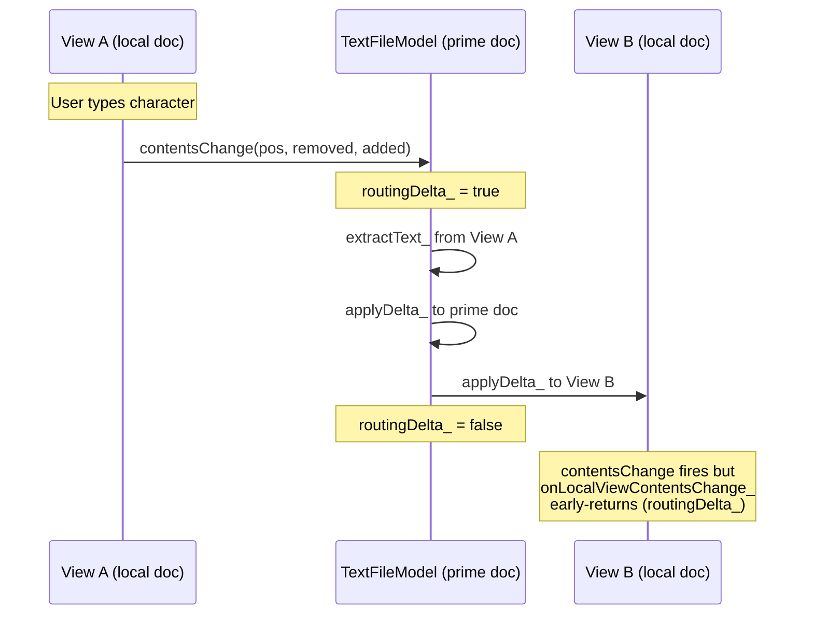
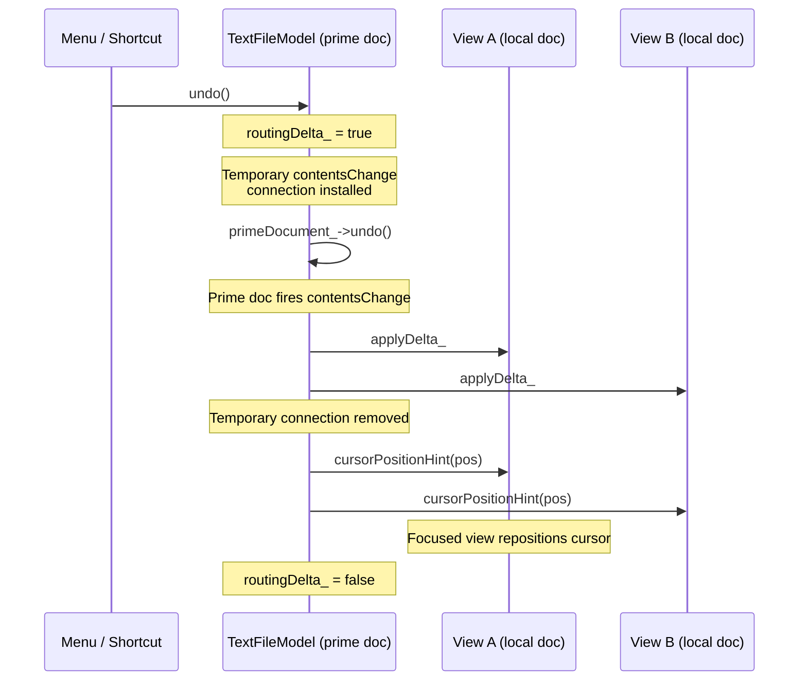
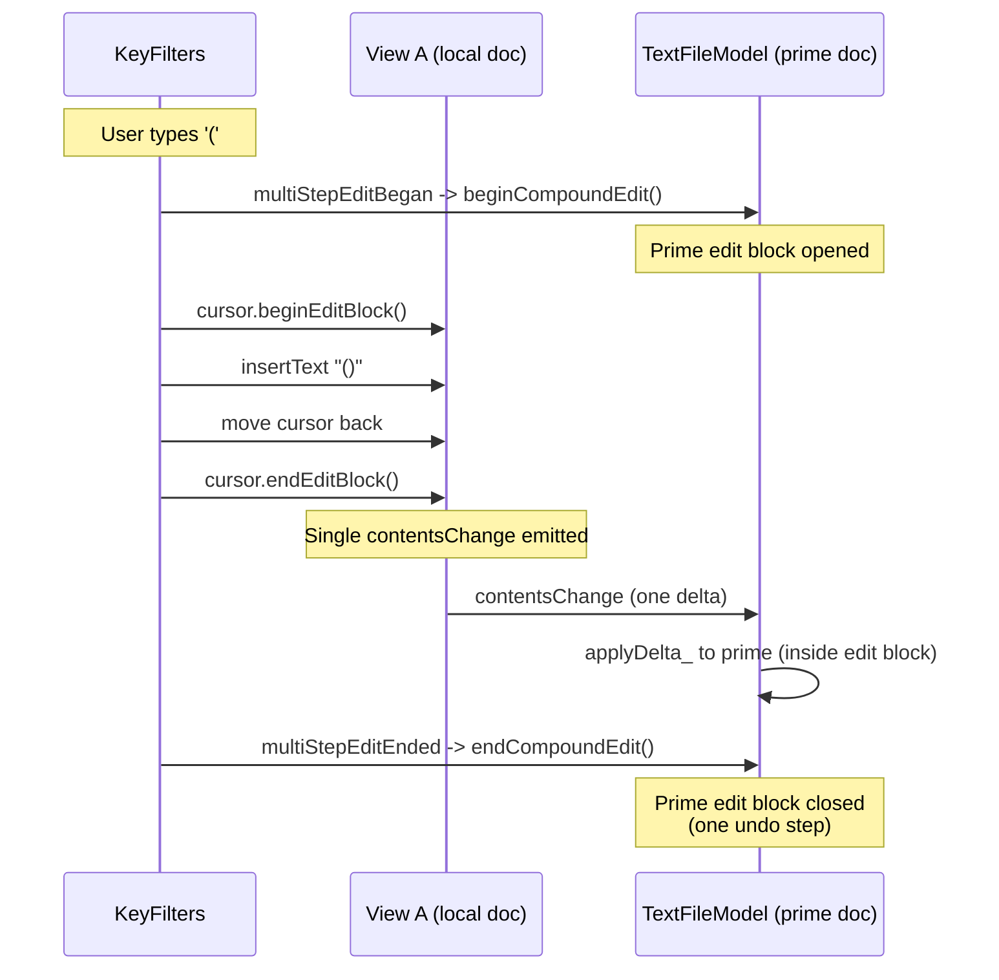

# Prime Document

When multiple windows display the same file, each view needs its own `QTextDocument` for independent word wrap and layout. The prime document pattern/hack coordinates content between these independent documents, keeping a single authoritative copy that owns the undo/redo history while routing edits between views.

See: [`TextFileModel.h`](../src/TextFileModel.h), [`TextFileView.h`](../src/TextFileView.h), [`TextFileView.cpp`](../src/TextFileView.cpp), and [`KeyFilters.h`](../src/KeyFilters.h)

## Problem

Qt's `QTextDocument` combines content and layout into a single object. When two `QPlainTextEdit` widgets share the same document via `setDocument()`, they share the same layout, including word wrap points. A narrow window and a wide window displaying the same document will wrap identically based on whichever width was set last, causing one window to show horizontal scroll instead of wrapping naturally.

## Solution

Giving each view its own `QTextDocument` means we have to fix the following issue: edits in one view must appear in all others, and undo/redo must work correctly across the set.

So, `TextFileModel` owns a **prime document**, a `QTextDocument` that serves as the canonical content and undo/redo owner. Each `TextFileView` creates its own **local view document** for display and editing. The model coordinates between them using *delta* (meaning *change*) *routing*:

1. User types in View A's local document
2. View A's document fires `contentsChange(pos, removed, added)`
3. The model extracts the added text and applies the delta to the prime document and all other view documents
4. A reentrancy guard (`routingDelta_`) prevents the downstream `contentsChange` signals from re-entering the routing loop

View documents have undo/redo disabled. All undo history lives on the prime document. When undo/redo is triggered, the model replays the resulting delta to all view documents and emits a cursor position hint so the focused view can reposition its cursor.

## Data Flow

### Normal Editing

### Undo/Redo

### Compound Edits (KeyFilters)

Multi-step key filter operations (auto-close, delete-pair, "barge") produce a single undo step through two cooperating layers:

1. **View layer**: `QTextCursor::beginEditBlock()` / `endEditBlock()` on the view's cursor coalesces multiple edits into a single `contentsChange` emission, so the model receives one delta instead of several
2. **Model layer**: `beginCompoundEdit()` / `endCompoundEdit()` opens an edit block on the prime document, grouping the routed delta into one undo step

## Reentrancy Guard

The `routingDelta_` flag prevents infinite loops. Without it:

1. View A fires `contentsChange`
2. Model applies delta to View B
3. View B fires `contentsChange`
4. Model would apply delta back to View A and the prime (corrupting content)

The `DeltaRoutingScope_` RAII wrapper ensures the flag is always reset, even if an exception occurs.

## Registration and Cleanup

Views register their local document via `registerViewDocument()` during setup. Cleanup happens automatically: a `QObject::destroyed` connection removes the view document from the routing list when it's deleted. An explicit `unregisterViewDocument()` is available for detaching a view document without destroying it but will probably go unused.

## Known Limitations

- **Cursor hint accuracy on compound undo**: `cursorPositionHint` reflects the position of the last delta during a compound undo/redo. For current compound operations (auto-close, delete-pair, barge), this is correct because the sub-edits touch adjacent positions. A future compound edit spanning distant positions could place the cursor at the wrong site.
- **Large-document bulk operations**: Operations like select-all-and-replace route the entire document content through cursor-based extraction and insertion per view. This is correct but produces a visible delay on very large documents (~1M+ characters). A future optimization could detect full-document replacements and short-circuit to `setPlainText`, perhaps.
- **`extractText_` paragraph separator conversion**: `QTextCursor::selectedText()` returns paragraph breaks as `QChar::ParagraphSeparator` (U+2029), which are converted to `\n` for reinsertion via `QTextCursor::insertText()`. This round-trip works in Qt 6 but is an implicit contract with Qt's text handling.
