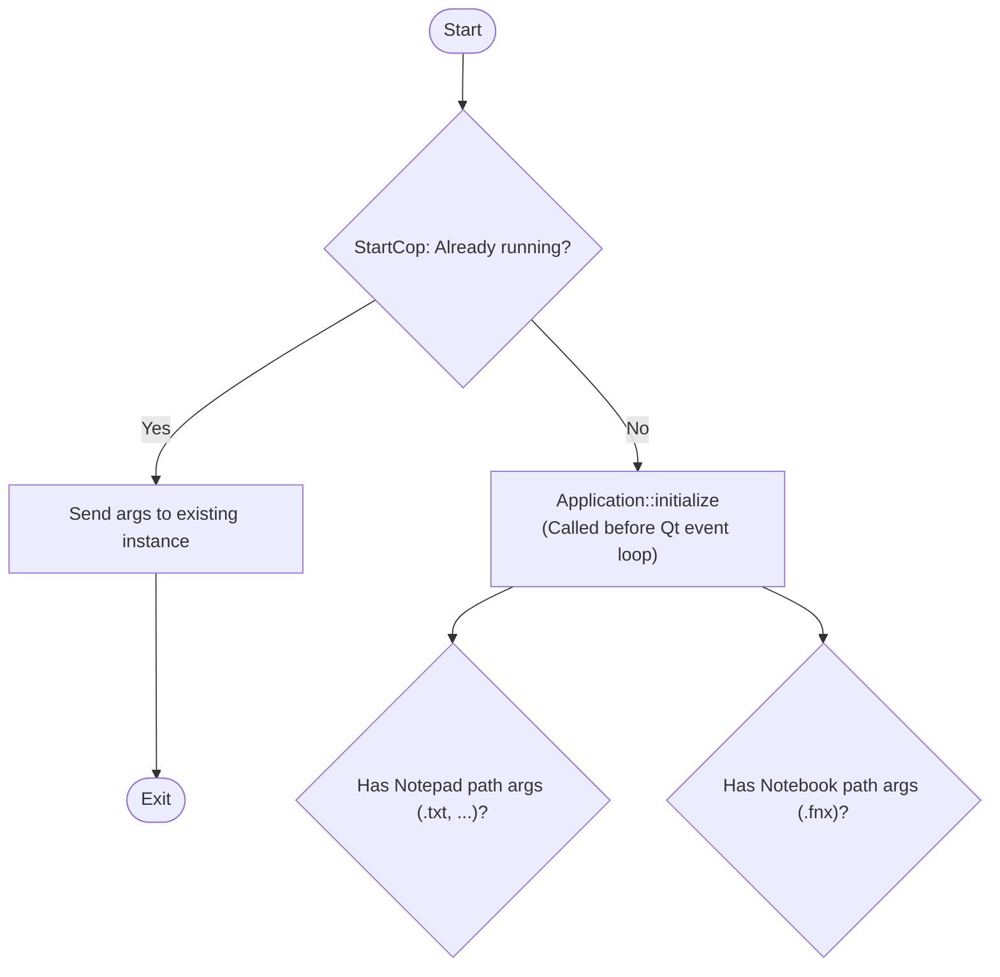

# Startup

```mermaid
flowchart TD
    Start([Start]) --> StartCop{StartCop: Already running?}
    StartCop -->|Yes| SendArgs[Send args to existing instance]
    SendArgs --> Exit1([Exit])

    StartCop -->|No| InitApp["Application::initialize<br>(Called before Qt event loop)"]

    InitApp --> CheckForNotepadArgs{"Has Notepad path args (.txt, ...)?"}
    InitApp --> CheckForNotebookArgs{"Has Notebook path args (.fnx)?"}

    %% Check for session for Notepad at some point and then also for each Notebook
```
