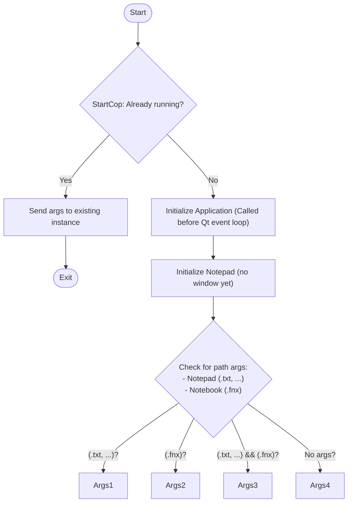

# Startup

```mermaid
flowchart TD
    Start([Start]) --> StartCop{StartCop: Already running?}
    StartCop -->|Yes| SendArgs[Send args to existing instance]
    SendArgs --> Exit1([Exit])
    StartCop -->|No| InitApp["Initialize Application (Called before Qt event loop)"]

    InitApp --> InitNotepad["Initialize Notepad (no window yet)"]
    InitNotepad --> CheckArgs{"Check for path args:<br>- Notepad (.txt, ...)<br>- Notebook (.fnx)"}

    CheckArgs -->|"(.txt, ...)?"| Args1
    CheckArgs -->|"(.fnx)?"| Args2
    CheckArgs -->|"(.txt, ...) && (.fnx)?"| Args3
    CheckArgs -->|"No args?"| Args4
```
