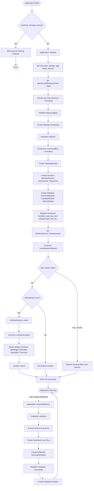

# Startup

```mermaid
flowchart TD
    Start([Application Starts]) --> StartCop{StartCop: Already running?}
    StartCop -->|Yes| SendArgs[Send args to existing instance]
    SendArgs --> Exit1([Exit])

    StartCop -->|No| InitApp[Application::initialize]

    InitApp --> SetMeta[Set org name, domain, app name, version]
    SetMeta --> QuitPolicy[Set quitOnLastWindowClosed = false]
    QuitPolicy --> CreateUserDir[Create user data directory ~/.fernanda]
    CreateUserDir --> InitDebug[Initialize debug logging]

    InitDebug --> CreateNotepad[Create Notepad workspace]
    CreateNotepad --> InitNotepad[Notepad::initialize]

    InitNotepad --> CreateBus[Create Bus CommandBus + EventBus]
    CreateBus --> CreateSettings[Create SettingsModule]
    CreateSettings --> CreateServices[Create Services: WindowService, ViewService, FileService]
    CreateServices --> CreateModules[Create Modules: TreeViewModule, ColorBarModule, MenuModule]
    CreateModules --> RegisterCommands[Register command handlers: poly:new_tab, notepad:open_file, etc.]
    RegisterCommands --> SetCloseAcceptor[Set WindowService::closeAcceptor]

    SetCloseAcceptor --> EmitInit[Emit bus->workspaceInitialized]
    EmitInit --> CheckSession{Has session data?}

    CheckSession -->|Yes - Future| RestoreSession[Restore windows/files from session]
    CheckSession -->|No| CheckNewWindow{NewWindow::Yes?}

    CheckNewWindow -->|Yes| CreateWindow[WindowService::make]
    CheckNewWindow -->|No| SkipWindow[No window created]

    CreateWindow --> EmitWindowCreated[Emit bus->windowCreated]
    EmitWindowCreated --> SetupWindow[Setup window structure: TabWidget, MenuBar, StatusBar, TreeView]
    SetupWindow --> ShowWindow[window->show]

    ShowWindow --> EventLoop[Enter Qt event loop]
    SkipWindow --> EventLoop
    RestoreSession --> EventLoop

    EventLoop --> Running([Application Running])

    Running -.->|User creates Notebook| CreateNotebook[Application::makeNotebook_]
    CreateNotebook --> InitNotebook[Notebook::initialize]
    InitNotebook --> NotebookExtract[Extract archive to temp dir]
    NotebookExtract --> NotebookBus[Create Notebook's own Bus]
    NotebookBus --> NotebookServices[Create Notebook Services/Modules]
    NotebookServices --> NotebookCommands[Register notebook: commands]
    NotebookCommands --> NotebookWindow[Create Notebook window]
    NotebookWindow --> Running
```
