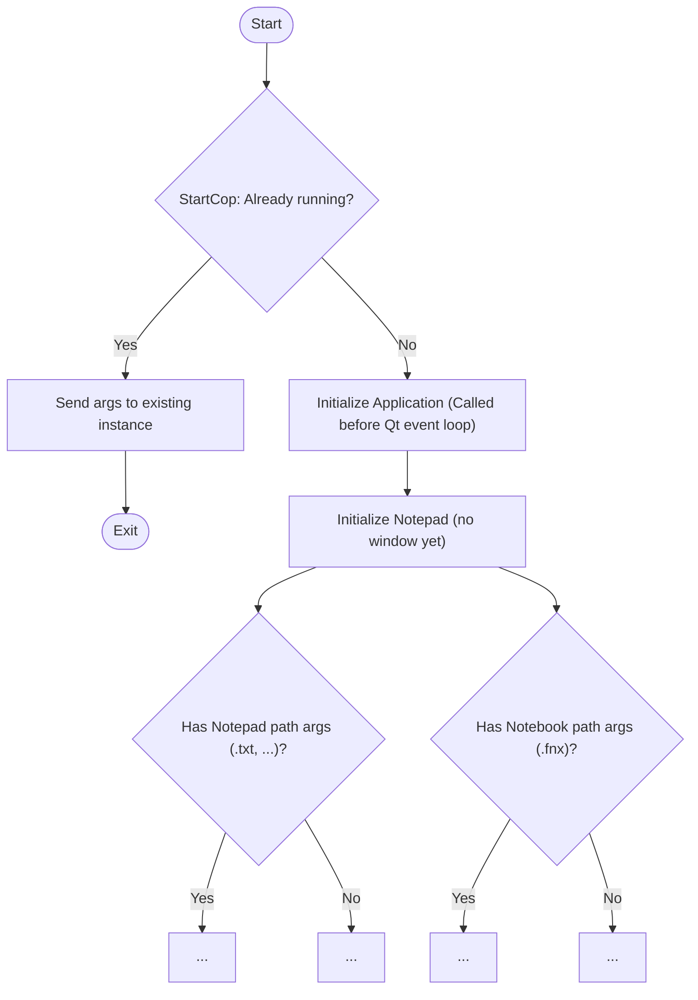

# Startup

```mermaid
flowchart TD
    Start([Start]) --> StartCop{StartCop: Already running?}
    StartCop -->|Yes| SendArgs[Send args to existing instance]
    SendArgs --> Exit1([Exit])
    StartCop -->|No| InitApp["Initialize Application (Called before Qt event loop)"]

    InitApp --> InitNotepad["Initialize Notepad (no window yet)"]
    InitNotepad --> CheckForNotepadArgs{"Has Notepad path args (.txt, ...)?"}
    InitNotepad --> CheckForNotebookArgs{"Has Notebook path args (.fnx)?"}

    CheckForNotepadArgs -->|Yes| A[...]
    CheckForNotepadArgs -->|No| B[...]

    CheckForNotebookArgs -->|Yes| C[...]
    CheckForNotebookArgs -->|No| D[...]

    %% Check for session for Notepad at some point and then also for each Notebook
```
