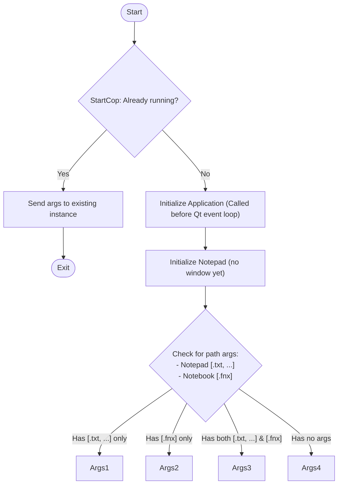

# Startup

```mermaid
flowchart TD
    Start([Start]) --> StartCop{"StartCop: Already running?"}
    StartCop -->|Yes| SendArgs["Send args to existing instance"]
    SendArgs --> Exit1(["Exit"])
    StartCop -->|No| InitApp["Initialize Application (Called before Qt event loop)"]

    InitApp --> InitNotepad["Initialize Notepad (no window yet)"]
    InitNotepad --> CheckArgs{"Check for path args:<br>- Notepad [.txt, ...]<br>- Notebook [.fnx]"}

    CheckArgs -->|"Has [.txt, ...] only"| Args1
    CheckArgs -->|"Has [.fnx] only"| Args2
    CheckArgs -->|"Has both [.txt, ...] & [.fnx]"| Args3
    CheckArgs -->|"Has no args"| Args4
```
