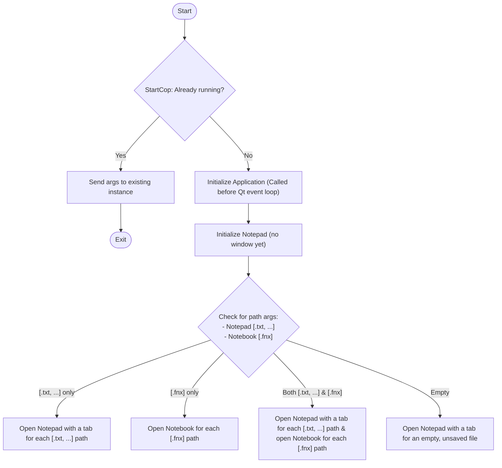

# Startup

```mermaid
flowchart TD
    Start([Start]) --> StartCop{"StartCop: Already running?"}
    StartCop -->|Yes| SendArgs["Send args to existing instance"]
    SendArgs --> Exit1(["Exit"])
    StartCop -->|No| InitApp["Initialize Application (Called before Qt event loop)"]

    InitApp --> InitNotepad["Initialize Notepad (no window yet)"]
    InitNotepad --> CheckArgs{"Check for path args:<br>- Notepad [.txt, ...]<br>- Notebook [.fnx]"}

    CheckArgs -->|"[.txt, ...] only"| ArgsTxtOpenNotepad["Open Notepad with a tab for each [.txt, ...] path"]
    CheckArgs -->|"[.fnx] only"| ArgsFnxOpenNotebook["Open Notebook for each [.fnx] path"]
    CheckArgs -->|"Both [.txt, ...] & [.fnx]"| ArgsTxtFnxOpenNotepadNotebook["Open Notepad with a tab for each [.txt, ...] path & open Notebook for each [.fnx] path"]
    CheckArgs -->|"Empty"| ArgsNoneOpenNotepad["Open Notepad with a tab for an empty, unsaved file"]
```
