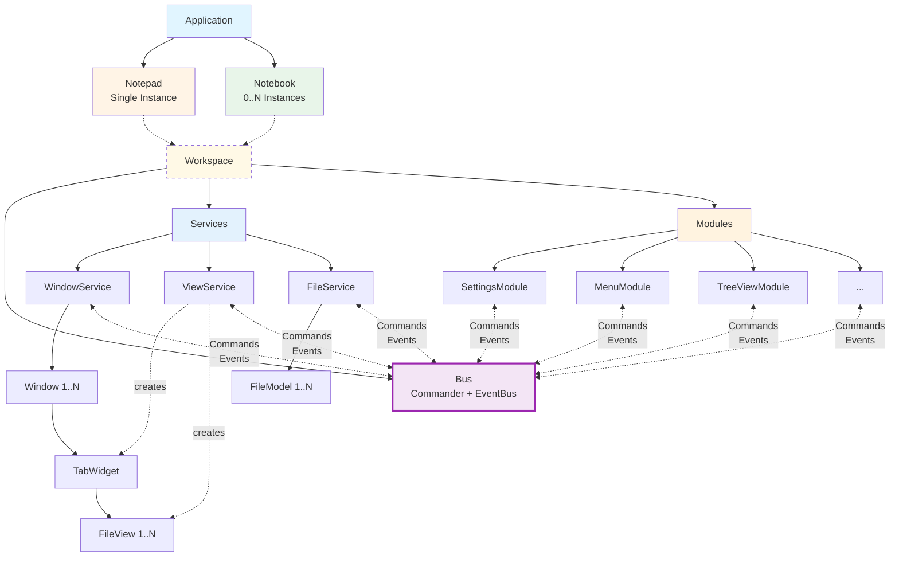

# Component Architecture

```mermaid
flowchart TD

    %% Need to show how we'll handle MenuModule

    App[Application]
    App --> Notepad[Notepad<br/>Single Instance]
    App --> Notebooks[Notebook<br/>0..N Instances]

    Notepad -.-> WS1[Workspace]
    Notebooks -.-> WS1

    WS1 --> Bus[Bus<br/>Commander + EventBus]
    WS1 --> Services[Services]
    WS1 --> Modules[Modules]

    Services --> WinSvc[WindowService]
    Services --> ViewSvc[ViewService]
    Services --> FileSvc[FileService]

    Modules --> SetMod[SettingsModule]
    Modules --> MenuMod[MenuModule]
    Modules --> TreeMod[TreeViewModule]
    Modules --> MiscMods[...]

    WinSvc --> Windows[Window 1..N]
    ViewSvc -.->|creates| TabWidget[TabWidget]
    Windows --> TabWidget

    ViewSvc -.->|creates| Views[FileView 1..N]
    TabWidget --> Views

    FileSvc --> Models[FileModel 1..N]

    WinSvc <-.->|Commands<br/>Events| Bus
    ViewSvc <-.->|Commands<br/>Events| Bus
    FileSvc <-.->|Commands<br/>Events| Bus

    SetMod <-.->|Commands<br/>Events| Bus
    MenuMod <-.->|Commands<br/>Events| Bus
    TreeMod <-.->|Commands<br/>Events| Bus
    MiscMods <-.->|Commands<br/>Events| Bus

    style App fill:#e1f5ff
    style WS1 fill:#fff9e6,stroke-dasharray: 5 5
    style Bus fill:#f3e5f5,stroke:#9c27b0,stroke-width:3px
    style Services fill:#e3f2fd
    style Modules fill:#fff3e0
    style Notepad fill:#fff4e6
    style Notebooks fill:#e8f5e9
```
