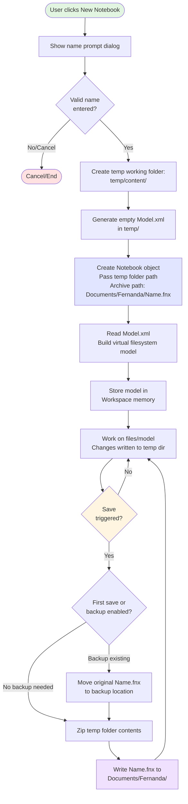

# Notebook Creation

TODO: Make sure this makes sense still

```mermaid
flowchart TD
    Start([User clicks New Notebook]) --> NamePrompt[Show name prompt dialog]
    
    NamePrompt --> ValidName{Valid name<br/>entered?}
    
    ValidName -->|No/Cancel| End1([Cancel/End])
    
    ValidName -->|Yes| CreateTemp[Create temp working folder:<br/>temp/content/]
    
    CreateTemp --> GenXML[Generate empty Model.xml<br/>in temp/]
    
    GenXML --> CreateNotebook[Create Notebook object<br/>Pass temp folder path<br/>Archive path: Documents/Fernanda/Name.fnx]
    
    CreateNotebook --> ReadXML[Read Model.xml<br/>Build virtual filesystem model]
    
    ReadXML --> StoreModel[Store model in<br/>Workspace memory]
    
    StoreModel --> WorkLoop[Work on files/model<br/>Changes written to temp dir]
    
    WorkLoop --> SaveTrigger{Save<br/>triggered?}
    
    SaveTrigger -->|No| WorkLoop
    
    SaveTrigger -->|Yes| BackupCheck{First save or<br/>backup enabled?}
    
    BackupCheck -->|Backup existing| BackupOriginal[Move original Name.fnx<br/>to backup location]
    
    BackupCheck -->|No backup needed| ZipTemp[Zip temp folder contents]
    
    BackupOriginal --> ZipTemp
    
    ZipTemp --> SaveArchive[Write Name.fnx to<br/>Documents/Fernanda/]
    
    SaveArchive --> WorkLoop
    
    style Start fill:#e1f5e1
    style End1 fill:#ffe1e1
    style CreateNotebook fill:#e1e5ff
    style SaveTrigger fill:#fff5e1
    style SaveArchive fill:#f0e1ff
```
