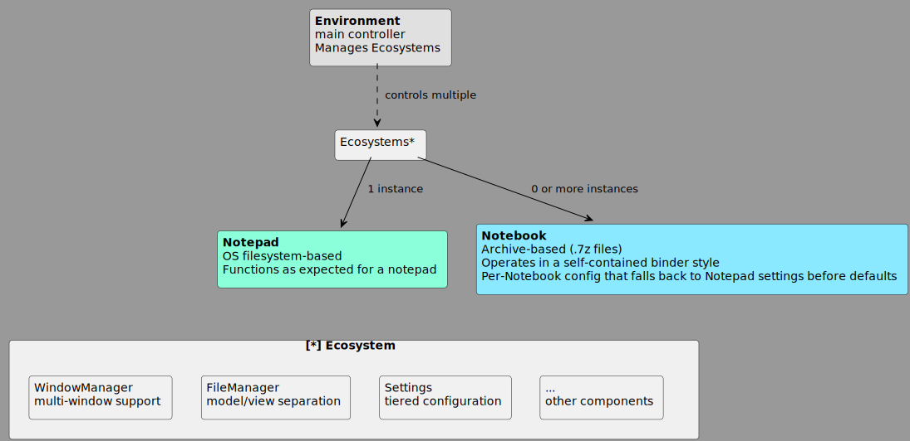

#  Fernanda

> Fernanda is a plain text editor for drafting long-form fiction. (At least, that's the plan.)

<p align="center">
	<a href="https://www.qt.io/"></a>
	<a href=""></a>
	<a href=""></a>
	<a href="LICENSE"></a>
</p>

> [!WARNING]  
> **This is a complete rewrite of Fernanda**, currently in early development. I was proud of the [previous version](https://github.com/fairybow/Fernanda-Legacy). It was a binder-style notebook application with themes and some other cool features, and was my very first C++ program. But, ultimately, I was unsatisfied with the code and how the program worked. This version started fresh with a cleaner architecture, is still actively in development, but is **not yet ready for any serious writing**.

## :tea: What's This?

Fernanda is a personal project to make a text editor I enjoy using for drafting long-form fiction. It's meant to be cozy, simple,  user-friendly, and enable faster drafting without getting in the way.

Fernanda is being rebuilt from the ground up with a focus on:
- **Clean architecture** - Proper separation of concerns
- **Tabbed interface**
- **Multi-window editing**
- **Dual "ecosystems"** - Notepad (regular files) and Notebooks (archive-based) *(notebooks coming soon)*
- **Extensible file types** - Polymorphic file system for different content types (`.txt`, `.story`, `.pdf`, `.png`, etc.`)

However, development might be slow, as I *do* plan on using it to write myself.

## :honeybee: Built With

- **C++20**
- **[Qt 6.9](https://www.qt.io/)**
- **Visual Studio 2022**
- **[Coco](https://github.com/fairybow/Coco)** (Qt utility submodule)

## :sunrise_over_mountains: What's Working

### Now
- :white_check_mark: **Multi-window text editing** with draggable tabs
- :white_check_mark: **Tab management** - Drag between windows or to desktop to create new windows
- :white_check_mark: **File operations** - New, open, save, save as, close
- :white_check_mark: **Edit operations** - Undo/redo, cut/copy/paste, select all
- :white_check_mark: **Settings persistence** - Font preferences, editor settings (tab width, word wrap, etc.)
- :white_check_mark: **Word counter** - Line, word, and character counts with smart performance scaling
- :white_check_mark: **Visual feedback** - Color bars for save success/failure
- :white_check_mark: **Window management** - Previous/next window navigation, save/close all
- :white_check_mark: **Smart tab titles** - Shows first line of untitled documents
- :white_check_mark: **Auto-close** - Complete common punctuation pairs and position the cursor in-between them

### Minimal Architecture Overview


## :construction: Roadmap and Notes-To-Self

### Near Future

- Auto-save
- File watching (preserving user work is, of course, paramount)
- "Barging"
- "Close everywhere" menu actions
- Tree view
- Tree view operations (new file, new folder, moving files, renaming)
- Setting tree view root and current root index
- Setting Ecosystem root
- Whether to make an FSTreeView and ArchiveTreeView or use the same widget for both
- Tree view close and toggle (closing manually will flip the menu option, too)
- Tree view recall / reset position
- Handle StartCop relaunched args in Environment
- Grabbable highlights
- Quote wrap
- Toggling language
- Shortcuts dialog in About
- Licenses dialog (or drop down) in About
- Notebook "color chip" for identification (may also show Notebook/Project name)
- Set SVG size for TabViewButton
- Review TabView::updateMouseHoverAfterLayoutChange_
- Clean up tab dragging code/notes in general
- Account for TreeView position in tab-to-desktop dragging new window position
- Clean up TextFile::onDocumentContentsChange_ code/notes
- Ensure previous/next tab menu items are handled on tab dragging
- Potentially turn off Qt's quit-on-last-window-closed behavior and always handle manually in Environment
- View menu TreeView toggler
- Ensure Settings dialogs close when last Ecosystem window closes

### Future

- Tools (timer, stay awake, etc.; potentially a tool framework for custom tools/extensions)
- Notebooks
- Path adapter for Notebooks (translate symbolic paths inside archive into temp paths)
- More Ecosystem extensions (like MenuManager) to reduce Ecosystem size
- Spellchecking and autocorrect
- Find and replace
- Optional integrated title/tab bar
- Add button snapping within a threshold of the right-hand side
- Scroll tab bar by dragging tab across it
- WordCounter refresh icon (OR clickable labels to refresh, with no button)
- WordCounter selection count
- WindowManager geometry management and application
- TabViewTabBarProxyStyle OR custom TabBar
- Settings dialog title based on parent Ecosystem

### Design issues

- Tab close button too far to the left
- Add button is not visually centered vertically
- Selected tabs should not elevate visually
- Unselected tabs should have no background themselves
- Unselected tabs should highlight on hover
- Selected tab should not highlight on hover
- Possible add debug statements to TR?
- Use extension filtering for Save As dialogs (in IFile::saveAs with IFile::preferredExt)
- Eventually, we may want to allow Fernanda to Save As files that aren't modifiable (i.e., renaming a PDF). Although, this would likely mean we just make those files "modifiable" but without letting them mark themselves as modified...

## :framed_picture: Installation

**Development builds only** - No installer yet. Build from source:

```bash
git clone --recursive https://github.com/fairybow/Fernanda
cd Fernanda
# Open in Visual Studio 2022
# Requires Qt 6.9 and Qt Visual Studio Tools
```

### Key Folders (when running)
- `%HOMEPATH%\.fernanda` - User data and settings
- `%HOMEPATH%\Documents\Fernanda` - Default location for files

## :fox_face: Thanks

Major thanks to:
- [@philipplenk](https://github.com/philipplenk) for teaching, interest, and Linux packaging of the original
- [@rikyoz](https://github.com/rikyoz) for the Bit7z library (likely to be integrated for notebook support once more)
- Anyone who tried the original version

The previous version of Fernanda (v0.27.1-beta60) is still available at the [old repo](https://github.com/fairybow/Fernanda-Legacy) and includes:
- "Working" .story (archive) notebooks (I have my suspicions about this, though)
- Theme customization
- Key filtering
- Timer, Stay-Awake, and Always-On-Top tools

This rewrite (v0.99) started fresh to build a more maintainable and user-friendly foundation.

## :memo: For Developers

### Contributing
This is a personal project and very much a work-in-progress. Feel free to explore the code, but expect rough edges and ongoing refactoring.

## :tangerine: Status

**Current version**: 0.99.0-beta.1 (approaching 1.0 rewrite)  
**Stability**: Early development  
**Recommended for**: Exploration only, not real work

---

Fernanda *means "adventurous, bold journey"* 
