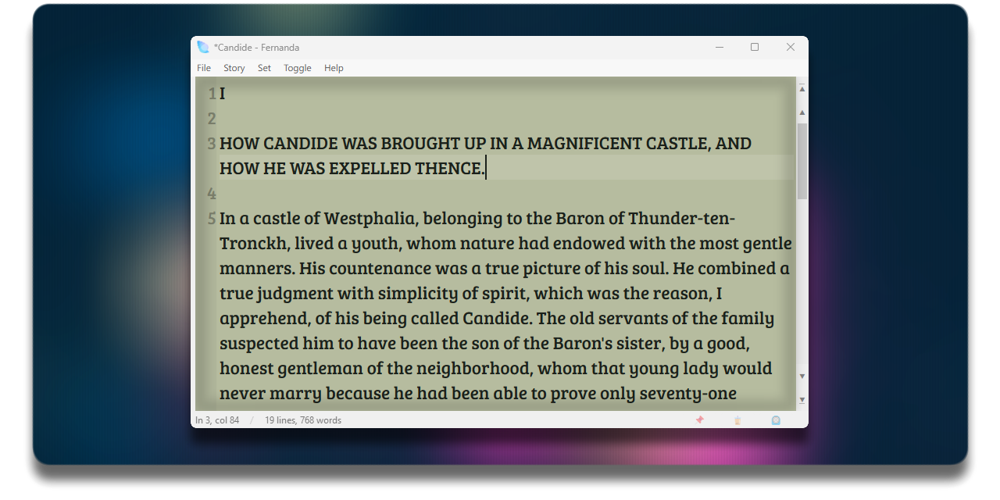
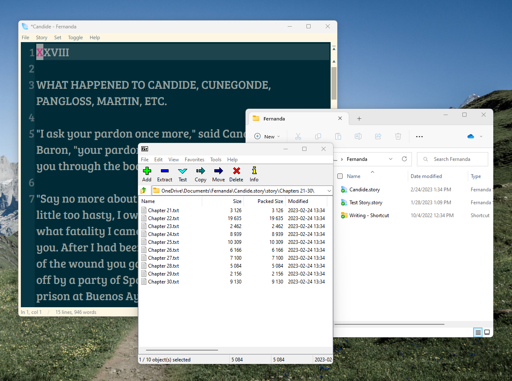
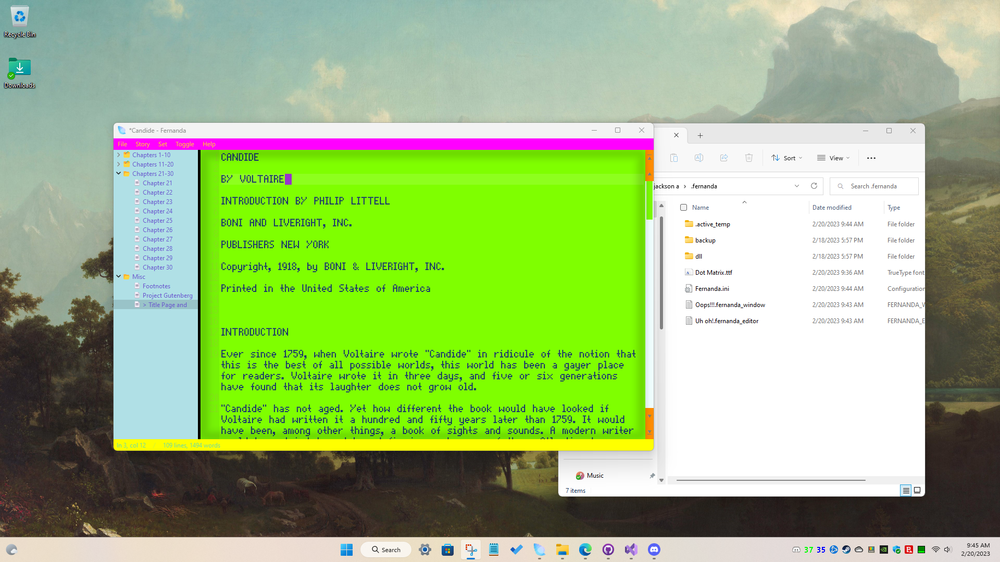
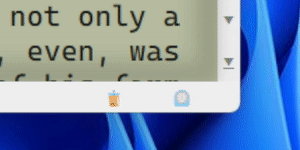
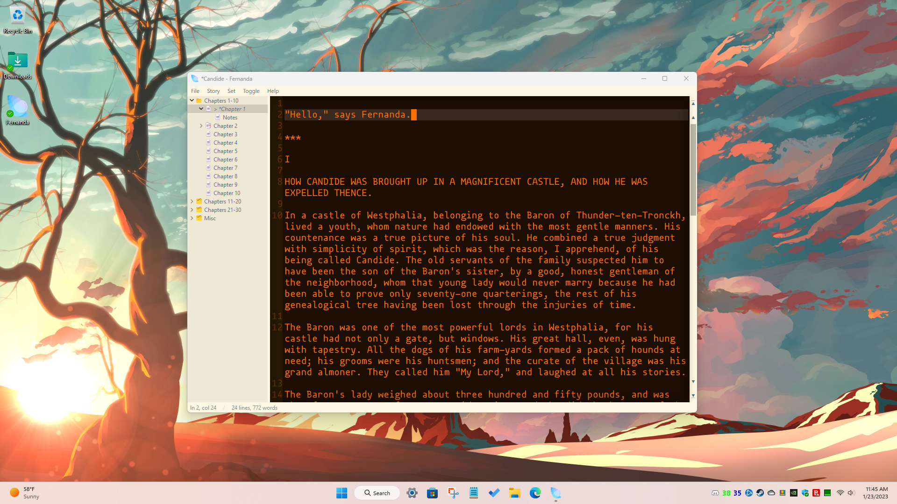
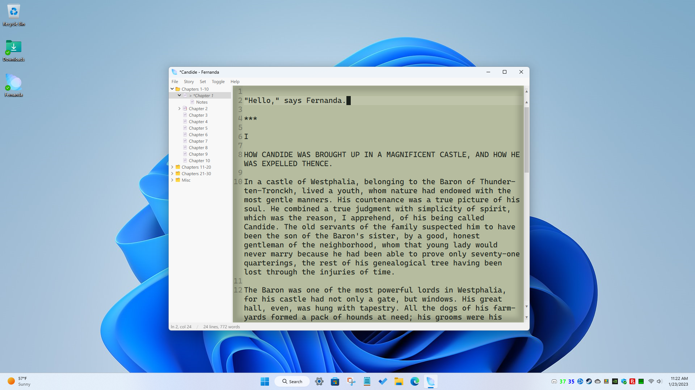
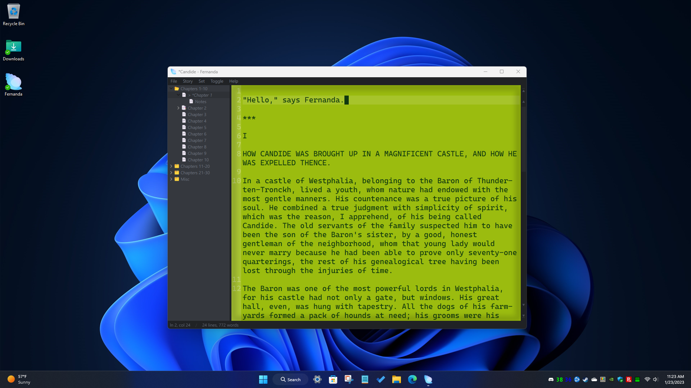
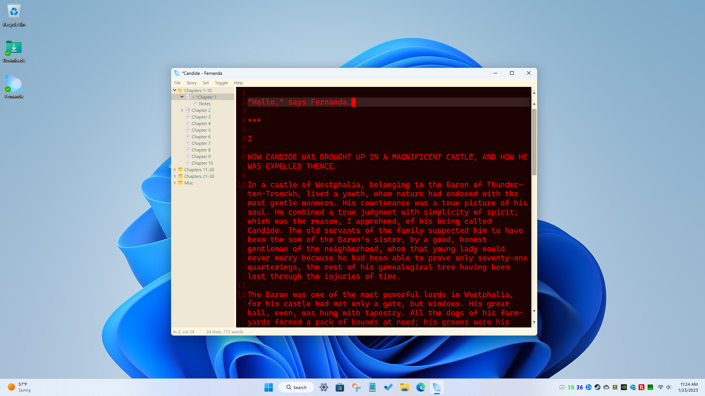
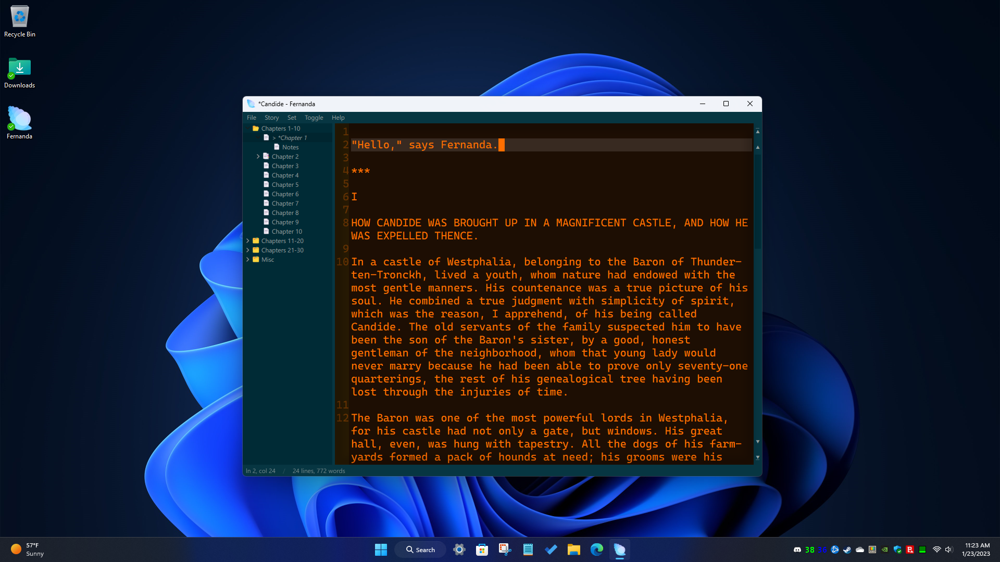

#  Fernanda

	
	
	
	 
	
	
	
	 
	

## :tea: **Hello**

> Fernanda is a plain text editor for drafting long-form fiction. (At least, that's the plan.)

- [About](#fallen_leaf-about)
- [Build](#honeybee-build)
- [Features](#sunrise_over_mountains-features)
	- [Key filtering](#features-key_filtering)
	- [Samples](#features-samples)
	- [Shortcuts](#features-shortcuts)
	- [`.story`](#features-files)
	- [Themes](#features-themes)
	- [Tools](#features-tools)
- [Installation](#framed_picture-installation)
- [Roadmap](#luggage-roadmap)
- [Thanks](#fox_face-thanks)
- [Screens](#moon_cake-screens)
- [Goodbye](#tangerine-goodbye)

## :fallen_leaf: **About**

> **Note** Keep in mind, this software is *in-progress*

This is a personal project, a work-in-progress, and I am *so* not a programmer. Still, I decided I didn't like existing novel-writing software very much, and I wanted to make something all my own. My hope is that it's easy to use, lightly-customizable, and distraction-free, for faster, more peaceful drafting.

You can try it [here](#framed_picture-installation).

Fernanda's look was inspired by the cozy feeling of using [WordStar](https://en.wikipedia.org/wiki/WordStar) on [DOSBox](https://www.dosbox.com/) to draft, and its interface was inspired by [Atom](https://github.com/atom/atom).

Fernanda got its name because I just really like the name a lot. But, as it turns out, Fernanda means an ["adventurous, bold journey"](https://en.wikipedia.org/wiki/Fernanda) (the kind one might be *called* to, say), and I think that's neat. 

[:arrow_up:](#top)

## :honeybee: **Build**

Fernanda is built with:
- C++
- [Qt](https://www.qt.io/)
- [Visual Studio Community](https://visualstudio.microsoft.com/vs/community/)
- and [NSIS](https://nsis.sourceforge.io/)

It relies on:
- Bit7z by [@rikyoz](https://github.com/rikyoz/bit7z)
- and, thus, 7-Zip by [Igor Pavlov](https://www.7-zip.org/)

The current default font is:
- Mononoki by [@madmalik](https://github.com/madmalik/mononoki)

Among the other fonts used are:
- Cascadia Mono by [@microsoft](https://github.com/microsoft/cascadia-code)
- Cozette by [@slavfox](https://github.com/slavfox/Cozette) (vectorized bitmap font, so looks crisp only at certain sizes)
- Day Roman by Apostrophic Labs
- Dot Matrix by [Dionaea Fonts](https://dionaea.com/information/fonts.php) (`Help > Create sample themes...`)
- Fixedsys Excelsior by [@kika](https://github.com/kika/fixedsys)
- Iosevka by [@be5invis](https://github.com/be5invis/Iosevka)
- More Perfect DOS VGA by [Zeh Fernando](https://zehfernando.com/) and [@L∆MEUR](https://laemeur.sdf.org/fonts/)
- Nouveau IBM by Arto Hatanp‰‰
- OpenDyslexic by [Abbie Gonzalez](https://opendyslexic.org/)
- and Ysabeau by [@CatharsisFonts](https://github.com/CatharsisFonts/Ysabeau)

Plus:
- Solarized theme palettes by [@altercation](https://github.com/altercation/solarized)
- [Markdown](https://www.markdownguide.org/)/[Fountain](https://fountain.io/) preview support provided with:
	- [Markdown-it](https://github.com/markdown-it/markdown-it)
		- Several Markdown-it plugins, like:
			- markdown-it-source-map by [@tylingsoft](https://github.com/tylingsoft/markdown-it-source-map)
	- github-markdown-css by [@sindresorhus](https://github.com/sindresorhus/github-markdown-css)
	- and Fountain.js by [@mattdaly](https://github.com/mattdaly/Fountain.js)

[:arrow_up:](#top)

## :sunrise_over_mountains: **Features**

**General:**
- Most things are togglable
- Settings are auto-saved
- Save backups (in [`{userdata}\backup\.rollback`](#folders))
- Global line, word, and character totals
- Export to PDF, text, or directory
- Markdown/Fountain preview

	<kbd>
		
		  Double-click the file pane (handle or unused surface) to collapse it. Then hover over the handle to open temporarily (and double-click again if you want to keep it that way).  
	</kbd>

---

**Key filtering:**

- Auto-closing for `"", (), {}, []`
- 2 spaces will skip the cursor past a closing item, closing the gap (see below)
- Auto em-/en-dash formatting from hyphen/minus key

	<kbd>
		
		  Key filtering  
	</kbd>

---

**Samples:**

A sample project, `Candide.story`, can be created from the `Help` menu, along with sample [themes](#features-themes) and a sample font.

---

**Shortcuts:**

- `F11`: Cycle editor themes (Amber, Green, Grey)
- `Alt` + `F10`: Cycle fonts
- `Alt` + `F11`: Cycle editor themes (all)
- `Alt` + `F12`: Cycle window themes
- `Alt` + `Insert`: Nav previous
- `Alt` + `Delete`: Nav next
- `Alt` + `Minus (-)` / `Ctrl` + `Mouse Wheel Down`: Decrease font size
- `Alt` + `Plus (+)` / `Ctrl` + `Mouse Wheel Up`: Increase font size
- `Ctrl` + `Y`: Redo
- `Ctrl` + `Z`: Undo
- `Ctrl` + `Shift` + `C`: Wrap selection or block in quotes

---

**`.story`:**

- They're 7-zip (`.7z`, non-compressed) archives
- They'll be associated with Fernanda by the installer and can be opened in the usual ways
- They can also be opened with [7-Zip](https://www.7-zip.org/), and the contents viewed and/or copied elsewhere
- Items deleted (cut) within Fernanda are moved to a `.cut` folder within the `.story` archive

The Story files are, of course, meant to be opened and edited with Fernanda. However, if you need to, you can also access their content via 7-Zip. If you choose to manually rename, move, or delete items within a `.story` file outside Fernanda, be sure to delete `story.xml` (at the root), too, so that it can be remade on next open. (You will lose any reorderings that are at the same directory level, as well as same-level, file-on-file parenting).

	<kbd>
		
		  A .story file's content can be accessed via 7-Zip if needed  
	</kbd>

---

**Themes:**

Fernanda comes with several two-tone editor themes inspired by retro displays and a few window themes, too. But it's also made to incorporate any custom themes you create and place in your user data folder. For template theme files ([`Sample.fernanda_editor`](./Fernanda/resources/sample/Sample.fernanda_editor) and [`Sample.fernanda_window`](./Fernanda/resources/sample/Sample.fernanda_window)), check the `Help` menu.

(Fernanda will also incorporate any `.ttf` and `.otf` font files you drop in your user data folder, too.)

	<kbd>
		
		  You can even make it look like this, if you're a real monster.  
	</kbd>

---

**Tools:**

- :pushpin: **Always on top:**
	- Pin Fernanda to the top of your window order
- :bubble_tea:	**Stay awake:**
	- Keep the screen awake without input (Windows only)
- :timer_clock: **Timer:**
	- A silent countdown timer (left-click to start or pause; right-click to reset)

	<kbd>
		
		  Timer  
	</kbd>

[:arrow_up:](#top)

## :framed_picture: **Installation**

You can grab the installer on the [Releases](https://github.com/fairybow/Fernanda/releases/) page. (AUR [here](https://aur.archlinux.org/packages/Fernanda).)

**Update:**
- Run the latest installer and overwrite.

**Remove:**
- Run the uninstaller, found in the installation folder
- Or remove the installation folder (however, running the uninstaller should also remove file association / certain registry information)

Fernanda should create the following folders on your OS:

**Folder locations:**

- `%HOMEPATH%\.fernanda`
	- e.g. `C:\Users\{username}\.fernanda`
	- This is the user data folder (using "-dev" creates a separate folder, `.fernanda (dev)`)
	- Backup (`.bak`) saves are here
- `%PROGRAMFILES%\Fernanda`
	- e.g. `C:\Program Files\Fernanda`
	- The default install location
- `%HOMEPATH%\Documents\Fernanda`
	- e.g. `C:\Users\{username}\Documents\Fernanda`
	- Where `.story` files are kept

They can be opened via the `Help` menu.

[:arrow_up:](#top)

## :luggage: **Roadmap**

Fernanda is available for Windows (beta pre-release) [above](#framed_picture-installation), and an early Arch Linux package is also available on the AUR (courtesy of [@philipplenk](https://github.com/philipplenk)).

Right now, I'm kind of going where the wind takes me. Fernanda is for drafting. Specifically, for me, it's for encouraging a more productive drafting headspace, and any features that seem like a must for making that happen easier, I'm going to try and add.

In my mind, near-finished work can be revised in other programs. So, some things you might find in other binder-style writing programs aren't necessarily on the table for me right now (but also not necessarily out-of-the-question, either). I'm not interested in adding spellcheck, for example. I think for my purposes it would be distracting. Nor am I interested in any kind of highly-involved formatting or pre-publishing processes. I am, however, planning on adding a way to mark files for compilation for general export (one big file, or several if you want, where things more drafty than others, or notes, can be left out). Ways to view outlines or organize smaller notes or scraps (or even map them) is not necessarily out-of-the-question.

If I think of something big, I'll try to add it right here. Otherwise, these things, of varying importance or levels of commitment, will also appear in [To-do.md](./Fernanda/docs/To-do.md).

- Persist undo/redo stacks between file changes
- Separators and possibly customizable file icons, for better mental organization at-a-glance
- Simple storage of links and research materials
- Markdown/Fountain export
- Scroll sync for Fountain between editor and preview
- StatusBar and/or file menu auto-collapse (and expand on hover)

More to come.

[:arrow_up:](#top)

## :fox_face: **Thanks**

A major thanks to [@philipplenk](https://codemetas.de/) for their teaching and interest and support in helping me work toward a small dream like this (and for helping me make Fernanda available for [Arch Linux](https://aur.archlinux.org/packages/Fernanda)).

A major thanks, too, to [@rikyoz](https://github.com/rikyoz/) for their tireless work on the very amazing [Bit7z library](https://github.com/rikyoz/bit7z).

[:arrow_up:](#top)

## :moon_cake: **Screens**

<table>
	<thead>
		<tr>
			<th colspan="2">
				

					<kbd>
						
						  Fernanda v0.26.1-beta57 running on Windows 11.  Themes: window Light / editor Snooze; Font: Mononoki by <a href="https://github.com/madmalik/mononoki">@madmalik</a>.  
					</kbd>
				

			</th>
		</tr>
	</thead>
	<thead>
		<tr>
			<th colspan="2">
				

					<kbd>
						
						  Fernanda v0.14.0-beta32 running on Windows 11.  Wallpaper: "Red sky background" by <a href="https://www.deviantart.com/masterteacher/art/Red-sky-background-356199141">MasterTeacher</a>; Themes: window Solarized Light / editor Snooze; Font: Mononoki by <a href="https://github.com/madmalik/mononoki">@madmalik</a>.  
					</kbd>
				

			</th>
		</tr>
	</thead>
	<tbody>
		<tr>
			<td>
				

					<kbd>
						
						  Fernanda v0.14.0-beta32 Themes: window Light / editor Pocket  
					</kbd>
				

			</td>
			<td>
				

					<kbd>
						
						  Fernanda v0.14.0-beta32 Themes: window Dark / editor Pocket-Alt  
					</kbd>
				

			</td>
		</tr>
		<tr>
			<td>
				

					<kbd>
						
						  Fernanda v0.14.0-beta32 Themes: window Solarized Light / editor Snooze-Alt  
					</kbd>
				

			</td>
			<td>
				

					<kbd>
						
						  Fernanda v0.14.0-beta32 Themes: window Solarized Dark / editor Snooze  
					</kbd>
				

			</td>
		</tr>
	</tbody>
</table>

[:arrow_up:](#top)

## :tangerine: **Goodbye**

[:arrow_up:](#top)
