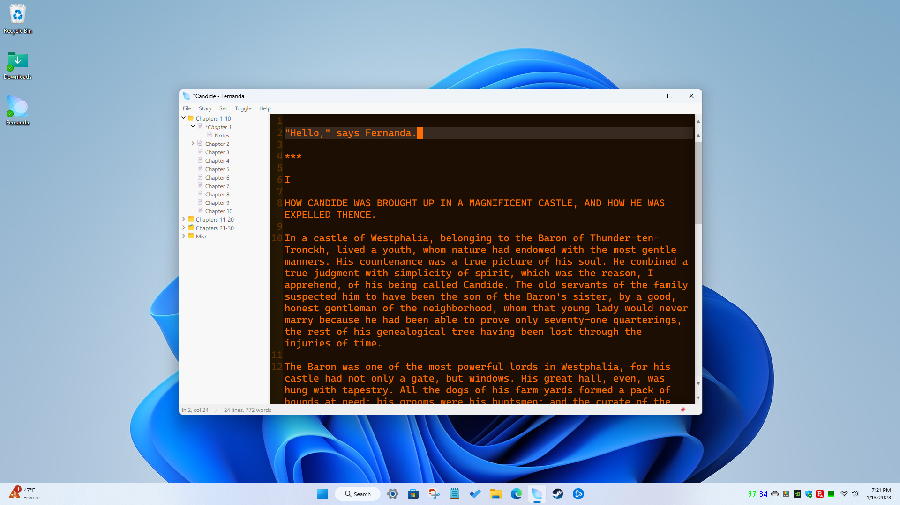
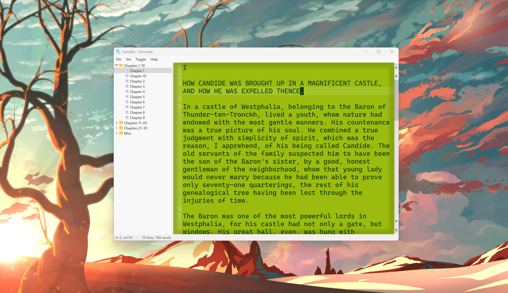

#  Fernanda 

	<kbd>
		
		 Fernanda v0.9.1.20 running on Windows 11.
	</kbd>

	
	
	 
	
	
	
	

## :tea: **Hello** 

Fernanda is a plain text editor for drafting long-form fiction. (At least, that's the plan.)

- [About](#about)
- [Roadmap](#roadmap)
- [Build](#build)
- [Features](#features)
	- [Keyfilters](#features-keyfilters)
	- [Shortcuts](#features-shortcuts)
	- [`.story`](#features-files)
	- [Tools](#features-tools)
- [Installation](#install)
- [Thanks](#thanks)
- [Bye](#bye)

## :heartpulse: **About** 

This is a personal project, a work-in-progress, and I am *so* not a programmer. Still, I decided I didn't like existing novel-writing software very much, and I wanted to make something all my own. My hope is that it's easy to use, lightly-customizable, and distraction-free, for faster, more peaceful drafting.

Fernanda's look was inspired by the good, quiet feeling of using [WordStar](https://en.wikipedia.org/wiki/WordStar) on [DOSBox](https://www.dosbox.com/) to draft, and its interface was inspired by [Atom](https://github.com/atom/atom).

Fernanda got its name because I just really like the name a lot. But, as it turns out, Fernanda means an ["adventurous, bold journey"](https://en.wikipedia.org/wiki/Fernanda) (the kind one might be *called* to, say), and I think that's neat. 

[&#9166;](#top)

## :compass: **Roadmap** 

- [Releases (Windows x64)](https://github.com/fairybow/fernanda/releases)

- [AUR](https://aur.archlinux.org/packages/fernanda)

An early Windows release is available for testing, and an early Arch Linux package is also available on the AUR (courtesy of [@philipplenk](https://github.com/philipplenk)).

Right now, I'm kind of going where the wind takes me. Fernanda is for drafting. Specifically, for me, it's for encouraging a more productive drafting headspace, and any features that seem like a must for making that happen easier, I'm going to try and add.

In my mind, near-finished work can be revised in other programs. So, some things you might find in other binder-style writing programs aren't necessarily on the table for me right now (but also not necessarily out-of-the-question, either). I'm not interested in adding spellcheck, for example. I think for my purposes it would be distracting. Nor am I interested in any kind of highly-involved formatting or pre-publishing processes. I am, however, planning on adding a way to mark files for compilation for general export (one big file, or several if you want, where things more drafty than others, or notes, can be left out). Ways to view outlines or organize smaller notes or scraps (or even map them) is not necessarily out-of-the-question.

If I think of something big, I'll try to add it right here. Otherwise, these things, of varying importance or levels of commitment, will also appear in [todo.md](./fernanda/docs/todo.md).

- Persist undo/redo stacks between file changes
- Separators and possibly customizable file icons, for better mental organization at-a-glance
- Simple storage of links and research materials
- Global word count
- Exporting

More to come.

[&#9166;](#top)

## :honeybee: **Build** 

Fernanda is built with:
- C++
- [Qt](https://www.qt.io/)
- [Visual Studio Community](https://visualstudio.microsoft.com/vs/community/)
- and [NSIS](https://nsis.sourceforge.io/)

Fernanda's `.story` files rely on:
- Bit7z by [@rikyoz](https://github.com/rikyoz/bit7z)
- and, thus, 7-zip by [Igor Pavlov](https://www.7-zip.org/)

Among the fonts used are:
- Cascadia Mono by [@microsoft](https://github.com/microsoft/cascadia-code)
- Cozette :purple_heart: by [@slavfox](https://github.com/slavfox/Cozette) (vectorized bitmap font, so looks crisp only at certain sizes)
- Day Roman by Apostrophic Labs
- Dot Matrix by [Dionaea Fonts](https://dionaea.com/information/fonts.php) (`Help > Create sample themes...`)
- Fixedsys Excelsior by [@kika](https://github.com/kika/fixedsys)
- Iosevka by [@be5invis](https://github.com/be5invis/Iosevka)
- Mononoki by [@madmalik](https://github.com/madmalik/mononoki)
- More Perfect DOS VGA by [Zeh Fernando](https://zehfernando.com/) and [@L∆MEUR](https://laemeur.sdf.org/fonts/)
- Nouveau IBM by Arto Hatanp‰‰
- OpenDyslexic by [Abbie Gonzalez](https://opendyslexic.org/)
- and Ysabeau by [@CatharsisFonts](https://github.com/CatharsisFonts/Ysabeau)

Solarized theme palettes by [@altercation](https://github.com/altercation/solarized)

[&#9166;](#top)

## :star: **Features** 

**General:**
- Most things are togglable
- Settings are auto-saved
- Incorporation of custom themes and fonts (`.ttf` and `.otf`)
- Examples (project and custom themes and font) available via the `Help` menu
- Save backups (in [`{userdata}\backup\.rollback`](#folders))

---

**Keyfilters:** 
- Auto-closing for `"", (), {}, []`
- 2 spaces will skip the cursor past a closing item, closing the gap (see below)
- Auto em-/en-dash formatting from hyphen/minus key

	<kbd>
		
		 Keyfilters
	</kbd>

---

**Shortcuts:** 
- `Ctrl + Shift + C` wraps a selection or block in quotes

---

**`.story`:** 
- They're 7-zip (`.7z`, non-compressed) archives
- They'll be associated with Fernanda by the installer and can be opened in the usual ways
- They can also be opened with [7-zip](https://www.7-zip.org/), and the contents viewed and/or copied elsewhere
- Items deleted (cut) within Fernanda are moved to a `.cut` folder within the `.story` archive

If you want to manually rename, move, or delete items within a `.story` file via 7-zip, be sure to delete `story.xml`, too, so that it can be remade on next open. (You will lose any reorderings that are at the same directory level, as well as same-level, file-on-file parenting).

---

**Tools:** 
- :pushpin: **Always-on-top:**
	- Pin Fernanda to the top of your window order
- :tea:	**Stay awake:**
	- Keep the screen awake without input (Windows only)

[&#9166;](#top)

## :floppy_disk: **Installation** 

You can grab the installer on the [Releases](https://github.com/fairybow/fernanda/releases/) page.

**Update:**
- Run the latest installer and overwrite.

**Remove:**
- Run the uninstaller, found in the installation folder
- Or remove all the below folders (however, running the uninstaller should also remove file association / certain registry information)

**Folder locations:** 
- `%HOMEPATH%\.fernanda`
	- e.g. `C:\Users\{username}\.fernanda`
	- This is the user data folder (using "-dev" creates a separate folder, `.fernanda (dev)`)
- `%PROGRAMFILES%\Fernanda`
	- e.g. `C:\Program Files\Fernanda`
	- The default install location
- `%HOMEPATH%\Documents\Fernanda`
	- e.g. `C:\Users\{username}\Documents\Fernanda`
	- Where `.story` files are kept

They can be opened via the `Help` menu.

[&#9166;](#top)

## :smiley_cat: **Thanks** 

A major thanks to [@philipplenk](https://codemetas.de/) for their teaching and interest and support in helping me work toward a small dream like this (and for helping me make Fernanda available for [Arch Linux](https://aur.archlinux.org/packages/fernanda)).

A major thanks, too, to [@rikyoz](https://github.com/rikyoz/) for their tireless work on the very amazing [bit7z library](https://github.com/rikyoz/bit7z).

[&#9166;](#top)

## :heartpulse: **Bye** 

Older screens:

	<kbd>
		
		 Fernanda running on Windows 11. (Wallpaper: "Red sky background" by <a href="https://www.deviantart.com/masterteacher/art/Red-sky-background-356199141">MasterTeacher</a>)
	</kbd>

[&#9166;](#top)
